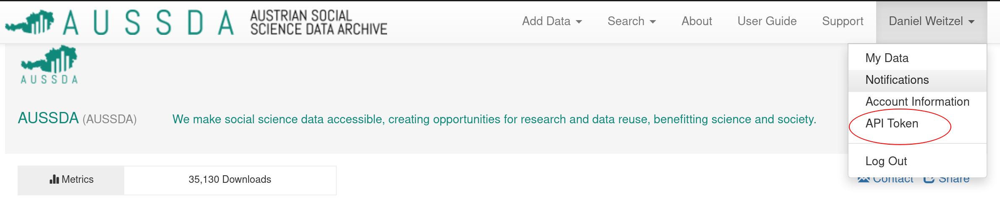

# politics-nonresponse


# How to run the code

## Install necessary packages

We recommend using conda to get the python packages:
```
conda env create -f environment.yml -n <name_of_environment>
```


## Get the data
In order to run the code one has to obtain the data from [AUSSDA dataverse](https://data.aussda.at/) first.
To be able to connect with the Dataverse API you will need an account with the AUSSDA dataverse. You can sign up through the SSO of your institution or using your email. After you have generated your account you'll need the `DATAVERSE_KEY`, which is the API Token that connects your API request with your registered dataverse account. You can obtain the API Token by logging into your account, clicking on your name in the top left, and selecting API Token as can be seen in the picture below.



After clicking on API Token you will be taken to a page (image below) where you can generate a 37 digit Token that is valid for one year. Under no circumstances should you share this token with anyone. Treat it like your username/password combination and make sure it is never included in code you share with others or push into a publicly available repository.


Once you have the API Token you can paste it into the `get_data.py` inside the `data/` folder and run it.


## Austrian National Election Study 2017

The AUTNES panel surveys for the most recent Austrian election in 2017 were collected in two different ways. There exists an online panel study with six waves (4 pre- and 2 post-election) as well as a multi-mode study with phone and online modes (2 pre- and 1 post-election waves each). The modes, sample sizes, and survey times are very well explained [here](https://autnes.at/en/autnes-data/general-election-2017/). In this repository we focus on the online panel.


# Contents
- [Sections](#sections)
  * [1. Predicting attrition](#1-predicting-attrition)
  * [2. Data exploration](#2-data-exploration)
  * [3. Clustering](#3-clustering)
  * [4. Identifying poor quality samples](#4-identifying-poor-quality-samples)
- [Comments to files which we were working on so far](#comments-to-files-which-we-were-working-on-so-far)
  * [Data](#data)
  * [Notebooks:](#notebooks)
      - [`online` survey](#-online--survey)
      - [`multi` survey](#-multi--survey)
  * [Results_html](#results-html)

# Sections
## 1. Predicting attrition
- in the most recent version classes are weighted manually (I have tried different weights - manual weighting helped not to have weird coefficients in logistic regression which were increasing with each wave), but the most optimal result was made with `class_weight="balanced"` parameter (in *Analysis_functions.ipynb* and *Analysis_functions_ensemble.ipynb* notebooks so maybe it makes sense to put it back, there we had recall of 60-70% for both classes

- independent features sets:

| all features | personal features combined with engineered ones | personal+engineered+gender_age combinations (dummies) | only personal
| --- | --- | --- | --- |
| hard to interpret and find the most important ones | basically same model quality, but easier interpretation | no significant improvements | comparable with all features or personal+engineered ones in terms of models quality

## 2. Data exploration
Notebook with many plots which we used to investigate influence of features (both initial and engineered) on attrition and on quality of responses 
## 3. Clustering 
Divide samples into groups wavewise, shown good stability of assigning people to the same groups, features which make the largest differences between clusters are mostly about immigrants, but there are some about parties dominance or corporations => helps to guess who is more left/right 
## 4. Identifying poor quality samples 
Mostly using intuition about inconsistent responses, drop outliers in terms of time, there's also *other y.ipynb* (for understanding what might lead for instanse to straightlining) but I could not find a good application for its results


# Comments to files which we were working on so far


## Data
- initial data files: *df_online.csv, df_multi.csv*
- prepared data files for each wave divided into personal and political features (changes by *data_preparation.ipynb* notebook)
## Notebooks:

#### `online` survey
- *data_preparation.ipynb* - functions to transform different types of features in corresponding ways, after function is created, most of them executed right away. Features in general are divided in a group as something that we know before from the very beginning (e.g. age, gender) - **personal** and features related to main questions about politics - **political**
- *dictionaries_rename.ipynb & dictionaries_rename.py* - notebook and its copy in `.py` format, used to rename features through import functions with dicts
- *clustering.ipynb* - unsupervised learning, bunch of methods compared and the best one used to cluster all the waves to get kind of left-right groups
- *y_panelpat.ipynb* - predict attrition (decision tree, logistic regression, linear/RBF SVM)
- *Analysis_functions.ipynb & Analysis_functions.py* - to make notebooks more compact here we took code for modeling part to a different file (decision tree, logistic regression, linear/RBF SVM)
- *Analysis_functions_ensemble.ipynb & Analysis_functions_ensemble.py* - same as above, but for XGBoost and random forest algorithms. Both were taking quite a time while did not produce better result, so in order not to wait 20 hours each time we run the analysis part, I made it to separate file
- *data_exploration.ipynb* - plots 
- *other y.ipynb* - using straighlining and "don't know" rates as dependent features to investigate quality insights (didn't help a lot btw, but short highlights partly at the end of file)
- *y_panelpat_ensemble.ipynb* - predict attrition (XGBoost and random forest)
- *y_panelpat_SMOTE.ipynb* - using SMOTE method for class balancing (tends to overfit)
- *y_panelpat_undersampling.ipynb* - just throwing random samples to handle unbalance issues (shows basically the same result as weighting classes which is used in other modeling files) 

#### `multi` survey
- just preparation and analysis files, no changes since May
## Results_html
- pivot table files with different metrics using 5-fold cross validation of train set and test set
- made for SMOTE, undersampling and weighted classes models
- opens with browser
- I usually filter results like this:


